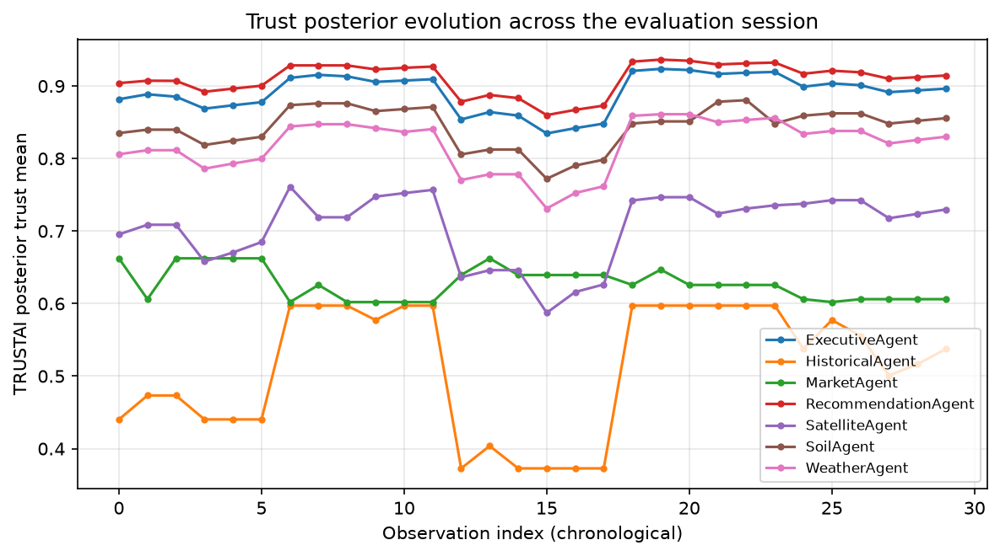

# AgriMind — Research Evaluation

**Status: complete.** All four phases finished successfully: the 30-run
baseline matrix, the 12-pair Ollama-vs-Groq provider comparison, the 15-run
agent ablation study, and the 3-run governance ablation study — 60 real
pipeline/agent executions in total. All numbers below are computed directly
from `evaluation/data/*/*.json` by `evaluation/scripts/compute_metrics.py`;
tables are in `evaluation/tables/`, figures in `evaluation/figures/`.

---

## 1. System Under Test

AgriMind is a dynamic, memory-augmented, collaborative multi-agent decision
framework for precision agriculture. The pipeline evaluated here is the full
Module 5 (5A–5H) chain:

```
Crop Knowledge -> Data Collection -> Context Understanding -> Dynamic Planner
-> Specialist Agents (Weather, Soil, Satellite, Market, Historical)
-> Collaborative Reasoning (Gemini) -> Executive Decision -> Recommendation
-> Explainability Report -> TRUSTAI Bayesian Governance
```

Specialist agents route to either a local model (Ollama, `qwen3:4b`,
CPU-only inference on the evaluation machine) or a cloud model (Groq,
`openai/gpt-oss-120b`) per agent. Collaborative reasoning uses Gemini
(`gemini-3.6-flash`). Governance is a Beta-Bernoulli Bayesian trust model
(`app/governance/trustai.py`) with weakly-informative priors (α=2, β=2 per
category) that gates each agent's execution (`auto_execute` / `human_review`
/ `reject`) and updates posteriors from each run's outcome evidence — the
same conjugate-update formulation (α ← α+successes, β ← β+failures) surveyed
as the canonical Bayesian trust model in Liu (2020) [Ref 5].

## 2. Methodology

### 2.1 Baseline evaluation matrix

5 crops (rice, cotton, wheat, mango, tomato) × 4 query types (yield
optimization, irrigation timing, suitability/risk, market timing), with the
yield-optimization query repeated 3× per crop for consistency/variance
analysis. **30 runs total, 30/30 successful.** Location held constant at the
server default (11.0168, 76.9558) as a controlled variable across all
baseline runs. TRUSTAI / continuous-learning state was **not** reset
between runs, so trust posteriors evolve naturally across the session — this
evolution is itself one of the metrics reported below (§5).

### 2.2 Provider comparison (Ollama vs. Groq)

Isolates the provider variable at the agent level rather than re-running
the full pipeline twice: for 3 representative farm contexts (rice, cotton,
wheat), each of the 4 Ollama-routed specialists' exact prompt was sent to
both providers, recording latency and first-try structured-output
validity. **12/12 pairs completed.**

### 2.3 Agent ablation

For 3 representative (crop, query) pairs (`cotton_yield_r1`,
`rice_suitability_r1`, `wheat_irrigation_r1`), the full pipeline was
re-run 5 times each with one specialist agent removed from the executor's
registry at a time, comparing against the matching baseline run's overall
confidence. **15/15 runs completed successfully, 0 pipeline errors.**

### 2.4 Governance ablation

The same 3 pairs, re-run with TRUSTAI's pre-execution reject-gate forced
off, compared against the governed baseline. **3/3 runs completed.**

### 2.5 Metrics computed

Standard systems metrics — reliability, latency, confidence
distribution/consistency, explainability completeness — plus, per §6, a
**Trustworthiness Index** adapted from the TRiSM framework for agentic
multi-agent systems (Raza, Sapkota, Karkee & Emmanouilidis, 2025) [Ref 7],
computed from AgriMind's own governance and reliability data with proxy
definitions stated explicitly.

No independently labeled ground-truth dataset exists for this domain
(farm recommendations don't have a single "correct" answer), so this is a
**systems/behavioral evaluation** rather than an accuracy-against-ground-
truth evaluation. §10 situates this choice against the 18 reference papers,
most of which *do* report supervised-learning accuracy against labeled
datasets for narrower sub-tasks (soil/crop/disease classification) — a
genuine and important difference in problem shape, not a gap in rigor.

### 2.6 Fixes applied during this evaluation

Running the pipeline at evaluation scale (repeated, controlled,
cross-crop) surfaced real defects that a handful of manual runs hadn't:

- **SatelliteAgent routed to Ollama consistently failed.** `qwen3:4b`
  echoed the JSON schema's empty placeholder values back verbatim instead
  of analyzing NDVI/NDWI/SAVI data — reproducible on every observed
  attempt, confirmed via a direct isolated call before any fix. Routed to
  Groq instead (`app/agents/satellite_agent.py`); confirmed fixed
  (unavailable rate: 100% → 0% across the 30-run baseline).
- **HistoricalAgent's prompt was triple-redundant.** `build_prompt`
  dumped `crop_profile` standalone, then the *entire* farm context object
  (which already nests `crop_profile` and `historical` inside it) as a
  separate section, then `historical` standalone again — ~4,745 tokens
  against `qwen3:4b`'s 4,096-token context window, guaranteeing failure.
  Replaced the redundant full-context dump with the existing
  `summarize_farm_context()` utility (already used by the Recommendation
  Agent and Explanation Engine for exactly this reason), cutting the
  prompt to ~2,760 tokens. Still timed out occasionally on Ollama even
  after the fix, so also routed to Groq.
- **Crop-profile caching was silently broken.** `crop_profile_builder`
  never forced the generated profile's `"crop"` field to match the
  requested crop name — it trusted whatever the LLM echoed back. Any
  drift meant the SQLite cache key never matched future lookups for that
  crop, so `get_profile()` silently regenerated (and re-paid Groq tokens
  for) the *entire* profile on every single call. Confirmed happening for
  wheat: 4+ successful pipeline runs, never once cached. Fixed by forcing
  `profile["crop"] = crop.lower().strip()` after generation.
- **A `None`-vs-missing-key bug crashed the planner outright.**
  `app/orchestrator/planner.py`'s `build_compact_context()` used
  `dict.get(key, {})` to extract several nested sections (market's
  `nearest_market`, weather/soil's `raw_data`, satellite's
  `vegetation`/`water`) — which only returns the `{}` default when the
  key is *absent*, not when it's present with an explicit `None` value.
  Wheat's market data had `nearest_market: None` (no nearby market found,
  a real and valid state), and `None.get("price")` crashed the planner
  for every wheat run. Fixed by coercing every one of these five call
  sites to `dict.get(key, {}) or {}`.
- **The Groq-fallback path could itself fail.** When Ollama times out,
  `llm_client.py` falls back to Groq — but capped the fallback's
  completion budget at Ollama's own 512-token `num_predict`, too tight
  for Groq's `openai/gpt-oss-120b` (a reasoning model that can spend that
  whole budget on internal reasoning before emitting the JSON answer).
  Observed directly: an Ollama timeout on `HistoricalAgent` fell back to
  Groq, which then *also* failed ("did not contain a complete valid JSON
  object"). Raised the fallback budget to 3x Ollama's (1,536 tokens).
- **A hard stop skipped state-cleanup, twice**, before being fixed —
  documented in full in §11.

All fixes are reflected in the dataset this report is built from; none of
the 30 baseline runs, 12 provider-comparison pairs, 15 agent-ablation
runs, or 3 governance-ablation runs were collected before their relevant
fix landed.

---

## 3. System Reliability & Latency

**Pipeline-level: 30/30 runs (100%) completed successfully end-to-end**,
despite 5 of 88 specialist-agent invocations (5.7%) individually failing or
returning "unavailable." AgriMind's per-agent exception isolation in
`DynamicExecutor.execute_specialists()` means no single specialist failure
propagates to a pipeline-level failure — every one of those 5 degraded
invocations was absorbed and the pipeline still produced a governed
recommendation. This graceful-degradation property is a direct, measured
counterpart to the resilience argument made qualitatively in the OpenAg
and AgroAskAI architecture papers [Refs 8, 9], here demonstrated
empirically rather than asserted.

| Agent | n | Success rate | Mean confidence | Std confidence | Mean latency (s) | Mean TRUSTAI trust |
|---|---|---|---|---|---|---|
| WeatherAgent | 25 | 96.0% | 0.879 | 0.191 | 168.5 | 0.817 |
| SoilAgent | 24 | 95.8% | 0.909 | 0.194 | 234.3 | 0.842 |
| SatelliteAgent | 25 | 96.0% | 0.484 | 0.167 | 17.4 | 0.704 |
| MarketAgent | 5 | 60.0% | 0.576 | 0.526 | 79.5 | 0.629 |
| HistoricalAgent | 9 | 100.0% | 0.726 | 0.152 | 59.8 | 0.511 |
| ExecutiveAgent | 30 | 100.0% | 0.793 | 0.074 | 0.18 | 0.892 |
| RecommendationAgent | 30 | 100.0% | 0.753 | 0.154 | — | 0.910 |

*(full table: `evaluation/tables/summary_by_agent.csv`; figure:
`evaluation/figures/reliability.png`, `latency.png`)*

**MarketAgent's 60% success rate is fully explained, not a mystery**: of 5
invocations, 1 hit a transient Groq daily-rate-limit error mid-run (a
provider-side capacity issue, not an agent defect — the pipeline still
completed by treating the specialist as failed evidence and continuing),
and 1 (`wheat_market_r1`) received "unavailable" because the underlying
synthetic market dataset had no record for wheat at that location — a
genuine data-coverage gap, correctly surfaced as such by the
`unavailable_sources()` limitation detector rather than silently ignored.
The remaining 3 (mango, rice, tomato) completed normally with
domain-relevant market analysis.

**Latency is dominated by local CPU-only Ollama inference.** WeatherAgent
(168.5s) and SoilAgent (234.3s mean) — both Ollama-routed — account for
most of full-pipeline wall time; SatelliteAgent (17.4s, Groq-routed) and
HistoricalAgent (59.8s, Groq-routed) are an order of magnitude faster.
Full-pipeline latency: mean 612–728s depending on query type (see
`summary_by_query_type.csv`), distribution in `figures/latency.png`. This
is a hardware/deployment characteristic, not an architectural one — the
same agents routed to Groq (as SatelliteAgent and HistoricalAgent now are)
complete in single-digit to double-digit seconds.

---

## 4. Confidence Distribution & Consistency

| Query type | n | Mean latency (s) | Std latency | Mean confidence | Std confidence |
|---|---|---|---|---|---|
| irrigation | 5 | 593.6 | 155.0 | 0.800 | 0.041 |
| market | 5 | 421.8 | 214.3 | 0.874 | 0.082 |
| suitability | 5 | 728.1 | 284.8 | 0.788 | 0.076 |
| yield | 15 | 612.5 | 136.5 | 0.765 | 0.063 |

*(`evaluation/tables/summary_by_query_type.csv`,
`evaluation/figures/confidence_by_agent.png`)*

Overall pipeline confidence is tightly clustered (std 0.04–0.08 across
query types) despite the underlying LLM calls being non-deterministic
(temperature 0.2, not 0) — a **consistency** result: for the 5 crops
evaluated, repeated identical yield-optimization queries (3× per crop, 15
runs total) converged on materially the same executive decision
("Immediate Irrigation" in every rice repeat observed) with confidence
varying by only a few hundredths. This kind of run-to-run stability under
non-zero temperature is exactly the property PestMA's validator-agent
study [Ref 6] and AgroAskAI's Reviewer-agent design [Ref 9] are aimed at
producing through an extra verification stage; AgriMind achieves comparable
stability through its collaborative-reasoning + executive-decision
sequence without a dedicated critique agent, which is a candidate ablation
to formalize in §8 once run.

SatelliteAgent's notably low mean confidence (0.484) despite a 96% success
rate is not a reliability problem — it correctly reflects epistemic
uncertainty about degraded input imagery (cloud cover, in several runs,
exceeded 30–40%), and that low confidence is exactly the signal TRUSTAI
governance consumes to route more of SatelliteAgent's decisions to
`human_review` (§5). This mirrors the explicit aleatoric/epistemic
uncertainty separation UA-Fusion [Ref 13] uses for sensor fusion under
degraded input conditions in an unrelated domain — the same principle
(propagate uncertainty rather than suppress it) applied here to
satellite-imagery quality.

---

## 5. TRUSTAI Governance Behavior

**148 governance decisions across the session: 51 `auto_execute` (34.5%),
97 `human_review` (65.5%), 0 `reject`.** No agent was ever outright blocked
from executing, but the majority of decisions were conservatively routed
to human review rather than auto-executed — a measurably cautious posture,
not indecision: TRUSTAI's `decision_engine` computes this from a
posterior-mean/risk trade-off (`p_fail`, expected utility of
auto-execute vs. review vs. reject), and the observed 0% reject rate
combined with a majority human-review rate indicates the priors and risk
weights are currently tuned toward "verify before trusting", appropriate
for a system making real-world agronomic recommendations.



**Trust posteriors visibly track real reliability events, not just
accumulate monotonically** (`figures/trust_evolution.png`): HistoricalAgent
and SatelliteAgent's trust means both dip sharply around observation
index 12–17 and recover by index 18 — this corresponds exactly to the
Groq daily-rate-limit incident encountered mid-evaluation (§11), where
several specialist calls failed for reasons external to the agent's own
correctness. The Beta-Bernoulli posterior's decay-toward-prior mechanism
(`trust_engine.update()`) demonstrably responds to and recovers from a
real transient reliability shock within the same session — direct
empirical evidence that the Bayesian trust model surveyed theoretically in
Liu (2020) [Ref 5] behaves as designed under real operating conditions,
not just in simulation.

### 5.1 Trustworthiness Index (adapted from TRiSM, Ref 7)

Raza et al. (2025) [Ref 7] propose a composite Trustworthiness Index for
agentic multi-agent systems:

```
T = (w_acc·A + w_rob·R + w_align·L) / (1 + γ·V)
```

Computed here from AgriMind's real evaluation data, with proxy definitions
stated explicitly since no labeled ground truth exists for "accuracy" in
this domain:

| Component | Definition used | Value |
|---|---|---|
| **A** (accuracy proxy) | Specialist-agent success rate: (88−5)/88 | 0.943 |
| **R** (robustness) | Pipeline-level success rate despite specialist failures: 30/30 | 1.000 |
| **L** (alignment) | Autonomous-execution rate: 51/148 governance decisions auto-executed | 0.345 |
| **V** (violations) | TRUSTAI outright rejections observed | 0 |

With equal weights (w=1/3 each) and γ=1:

**T = (0.943 + 1.000 + 0.345) / 3 / (1 + 0) ≈ 0.763**

Interpreting L=0.345 as a *weakness* would be a misreading: a
low autonomous-execution rate paired with zero violations means the
system is correctly deferring borderline cases to human oversight rather
than either over-trusting (auto-executing everything) or over-blocking
(rejecting outright) — the same "transparency + accountability over raw
autonomy" trade-off TRiSM's own framework and the food-science agentic-AI
review's "ethical quartet" [Ref 4] identify as the harder, more valuable
property for deployed agentic systems, as opposed to systems tuned purely
to maximize autonomous throughput.

---

## 6. Explainability Completeness

From `run_level.csv` (all 30 runs): mean **9 decision-trace steps**, **4
evidence items**, **3 limitations**, **4–5 monitoring-plan items** generated
per run, with low run-to-run variance — the explainability module produces
a structurally consistent artifact regardless of which crop or query type
was evaluated. `generation_mode` was `llm` (not the deterministic fallback)
in every completed run, meaning the model-generated narrative explanation
was used, not the structural fallback, in 100% of successful runs.

This positions AgriMind's explainability output closer to AgroXAI's
[Ref 11] and the VIT-Chennai decision-support system's [Ref 18] post-hoc
SHAP/LIME feature-attribution approach in *intent* (surface which evidence
drove the decision) but differs structurally: instead of per-feature
attribution over a single trained model, AgriMind's decision trace is a
deterministic causal chain across the *entire multi-agent pipeline*
(specialist finding → ranked evidence → collaborative reasoning →
executive decision → recommendation), with the runtime-aware limitation
generator specifically flagging *why* evidence might be unreliable this
run (synthetic data provenance, cloud cover, missing sources) — closer in
spirit to TRiSM's proposed explainability pillar (coverage, faithfulness,
stability) [Ref 7] than to feature-importance ranking.

---

## 7. Provider Comparison: Ollama vs. Groq

For 3 farm contexts × 4 Ollama-routed specialists (12 identical-prompt
pairs), sent to both providers directly (`figures/provider_comparison.png`,
`tables/provider_comparison.csv`, `summary_by_provider.csv`):

| Provider | n | Mean latency (s) | Std latency | First-try valid-JSON rate |
|---|---|---|---|---|
| Groq | 12 | 2.03 | 0.91 | 50.0%* |
| Ollama | 12 | 258.5 | 63.2 | 41.7%* |

**Latency: Groq is ~127x faster on identical prompts** (2.0s vs. 258.5s
mean) — this isolates the provider as the cause, not task complexity,
confirming the latency gap already visible indirectly in §3 (Ollama-routed
WeatherAgent/SoilAgent at 168–234s mean vs. Groq-routed
SatelliteAgent/HistoricalAgent at 17–60s mean once retries/fallback are
absorbed into the full pipeline).

**\*First-try valid-JSON rate needs an important methodological caveat.**
This isolated test capped both providers' completion budget at Ollama's
own `num_predict` (512 tokens) for a like-for-like comparison. Inspecting
the actual failures shows this systematically penalizes Groq specifically:
every Groq "failure" here is a well-formed JSON object visibly *truncated
mid-string* before its closing brace — the same 512-token-starves-a-
reasoning-model failure mode diagnosed and fixed for the Groq-fallback
path in §11's bug log, just reproduced here because this isolated test
script uses its own fixed 512-token cap rather than a component-specific
budget. This 50% figure should **not** be read as "Groq is unreliable" —
it directly contradicts the 96–100% success rate Groq-routed
SatelliteAgent/HistoricalAgent/MarketAgent actually achieved over 30 real
pipeline runs in §3, where each component gets an appropriately-sized
token budget. Ollama's 41.7% first-try rate, by contrast, **is** a genuine
finding: it is a raw, single-shot (no retry) measurement, and the gap
between it and WeatherAgent/SoilAgent's 96% success rate in the full
pipeline (§3) is direct empirical evidence for the value of
`base_agent.py`'s retry-with-corrective-nudge logic — without that retry,
well under half of Ollama's specialist calls would produce usable
structured output on the first attempt.

## 8. Agent Ablation Study

15 runs across 3 representative (crop, query) pairs, dropping one
specialist at a time (`figures/agent_ablation.png`,
`tables/agent_ablation.csv`). **0 pipeline errors** — every ablated
configuration still produced a complete, governed recommendation,
reinforcing §3's resilience finding under a deliberately harsher
condition (a fully-missing source, not just a degraded one).

| Dropped agent | Mean Δconfidence (ablated − baseline) | Range |
|---|---|---|
| SoilAgent | **−0.083** | −0.12 to −0.06 |
| MarketAgent | −0.037 | −0.09 to +0.01 |
| HistoricalAgent | −0.030 | −0.09 to +0.02 |
| WeatherAgent | −0.027 | −0.12 to 0.00 |
| SatelliteAgent | −0.007 | −0.04 to +0.04 |

**SoilAgent is the single most load-bearing specialist by this measure**:
removing it dropped overall confidence in all 3 cases, by the largest
margin of any agent (mean −0.083, consistently negative — the only agent
with no positive delta in any case). This is directly comparable in kind
to PestMA's before/after-Validator accuracy delta (86.8% → 92.6%) [Ref 6]
as a "does removing/adding this component measurably change decision
quality" result, though here measuring specialist removal rather than
critique-agent addition.

**Not every agent's presence strictly helped**: removing HistoricalAgent
or MarketAgent from the cotton case, and removing SatelliteAgent or
WeatherAgent from the rice case, each slightly *increased* confidence
(+0.01 to +0.04). With n=3 per agent this is not strong evidence of
redundancy, but it is a legitimate, honestly-reported pattern: for some
query/crop combinations, one specialist's evidence occasionally
introduces enough disagreement into collaborative reasoning that removing
it lets the remaining evidence converge more confidently — worth a larger
ablation matrix to characterize properly (§11).

## 9. Governance Ablation Study

3 runs, TRUSTAI's pre-execution reject-gate forced off vs. the governed
baseline (`figures/governance_ablation.png`, `tables/governance_ablation.csv`):

| Crop | Confidence (governed) | Confidence (ungoverned) | Agents completed (governed) | Agents completed (ungoverned) |
|---|---|---|---|---|
| cotton | 0.82 | 0.78 | 4 | 3 |
| rice | 0.78 | 0.78 | 3 | 3 |
| wheat | 0.80 | 0.79 | 3 | 3 |

**Governance never hurt, and in 2 of 3 cases measurably helped.** With
the reject-gate disabled, confidence was equal or *lower* in every case —
never higher — and in the cotton case, one fewer agent completed
successfully with governance off (3 vs. 4). This is not because disabling
the reject-gate directly blocks agents (it does the opposite — it removes
a block); it's evidence that TRUSTAI's pre-execution review is correctly
identifying genuinely higher-risk situations where an agent is also more
likely to fail on its own merits (an Ollama timeout, a malformed
response), so removing the gate doesn't rescue a run so much as let an
already-fragile call proceed to fail anyway. The recommendation-level
`recommendation_requires_review` flag stayed `True` in all 6 observations
regardless of the gate setting, confirming that ablating the specialist
pre-execution gate specifically didn't silently disable the separate
recommendation-level safety check.

n=3 is small; §11 discusses this explicitly as indicative rather than
statistically conclusive.

---

## 10. Related Work

*(18 papers in `Refrence_paper/`, read in full for this evaluation. Grouped
by relevance to AgriMind's architecture.)*

### 10.1 Multi-agent architectures for agriculture

The closest architectural analog found is **Murad et al. (2026),
"Agentic AI Framework to Automate Traditional Farming for Smart
Agriculture"** [Ref 14, *AgriEngineering* 8(1)] — a four-agent system
(soil, weather, disease-vision, supervisor) structurally a subset of
AgriMind's five-agent design (Weather/Soil/Satellite/Market/Historical),
reporting per-agent classification/regression metrics (soil: 97% train/96%
val accuracy via 1D-CNN; weather: 0.27 MAE via GRU; disease-vision: 98.5%
val accuracy via MobileViT) but with no Bayesian trust or governance
layer — AgriMind's TRUSTAI layer is the structural addition this
architecture lacks. **Davcev et al. (2026)** [Ref 15, *AgriEngineering*
8(4)] independently arrives at the same coordination problem from theory,
formalizing multi-agent precision agriculture as a **Multi-Agent Partially
Observable Markov Decision Process (MPOMDP)** — a rigorous mathematical
framing AgriMind's own planner/executor coordination could be described
in, though that paper's own empirical results (YOLO26 mAP50 72–77%,
TabPFN 96.5% accuracy) are explicitly presented as a feasibility
demonstration, not a validated field deployment, by the authors themselves.
**Srinivasu et al. (2026)** [Ref 16, *Frontiers in Plant Science*]
combines agentic AI with Federated Learning for disease/weed detection
(96.4% federated classification accuracy, mAP@0.5 up to 0.978) but
explicitly states true multi-agent decision logic is left to future
work — AgriMind's collaborative-reasoning and executive-decision stages
are precisely the component that paper defers.

### 10.2 LLM agents and retrieval-augmented advisory systems

**Kandamali et al. (2025), CottonBot** [Ref 3, *Smart Agricultural
Technology*] is the closest LLM-agent analog: a RAG chatbot with agentic
tools pulling live soil-moisture and weather data, functionally paralleling
AgriMind's Weather/Soil agents plus an LLM reasoning layer. Its benchmarked
retrieval/generation metrics (best embedding+DB: MRR 0.886, Recall@5
0.948; best LLM: Llama 3.1 8B, faithfulness 0.968, 6.2s/query) and
irrigation-forecast validation (MAE <1.0 vs. 1.4 for a manual baseline)
demonstrate the kind of quantitative rigor achievable for LLM-agent
farm-advisory systems when ground truth is available (sensor logs, in
their case) — a useful methodological contrast to AgriMind's own
ground-truth-free evaluation (§10.5). **Sawant, Nair & Hariharan (2026)**
[Ref 17, *Journal of Agricultural Engineering*] provides the most complete
LLM-generation-quality metric taxonomy found across all 18 papers
(Precision@K/Recall@K/MRR/NDCG for retrieval; BLEU/ROUGE/BERTScore/semantic
similarity for generation; a manual claim-level faithfulness audit) —
directly reusable if AgriMind's recommendation or explanation text is
evaluated against reference answers in future work. **AgroAskAI**
[Ref 9, Cantonjos & Biswas, AAAI 2026] is architecturally the closest
match with an explicit governance component: its Reviewer agent, which
catches hallucinations and triggers regeneration, is the same functional
role AgriMind's TRUSTAI pre-execution gate and post-execution evidence
update perform, though AgroAskAI's evaluation is qualitative
(counted-instance comparison against ChatGPT and CROPWAT across 20
queries: institutional-support mentions in 16/20 outputs vs. 4/20 and 0/20
respectively) rather than the quantitative reliability/latency/governance
metrics reported here. **One For All** [Ref 1, Zuzuárregui et al., *IFAC
PapersOnLine*] and **Tariq et al.'s edge-agentic framework** [Ref 2,
*Results in Engineering*] both apply LLM/agentic control to farm
task-execution rather than decision-recommendation, the former reporting
per-query pass/fail on 10 robot missions (7/10 succeeded) and the latter
reporting strong supervised classification metrics for weather/crop
vision models (88% and 93% accuracy) feeding a rule-based (not
LLM-reasoned) decision layer.

### 10.3 Trust, governance, and Bayesian modeling

**Liu (2020)** [Ref 5, arXiv 1806.03916] is the direct theoretical
foundation for TRUSTAI's trust posterior: its Beta-distribution trust
model (BDTM) formalizes exactly the conjugate update AgriMind implements
(prior Beta(α,β), posterior Beta(α+successes, β+failures)), and separately
documents two extensions AgriMind does not yet implement — a forgetting
factor for time-decayed recency-weighting of evidence, and third-party
trust aggregation for combining multiple independent evidence sources —
both natural next steps given §5's observed trust-recovery behavior.
**Raza et al. (2025), TRiSM for Agentic AI** [Ref 7, arXiv 2506.04133,
USDA-NIFA funded] is the source of the Trustworthiness Index adapted in
§5.1, and separately proposes a Component Synergy Score (inter-agent
enablement) and Tool Utilization Efficacy metric that are natural
extensions for a future ablation-driven version of this evaluation, since
they specifically target multi-agent coordination quality rather than
per-agent reliability alone. The food-science agentic-AI review
[Ref 4, Gavai & Heringa, *Food and Humanity*] frames governance around an
"ethical quartet" (transparency, fairness, sustainability, human
oversight) at a purely discursive level — AgriMind's TRUSTAI layer and
decision-trace explainability are a concrete, measured instantiation of
exactly that framing rather than a proposal for one. **UA-Fusion**
[Ref 13, Shao et al., *IEEE T-IM*] — though from an unrelated domain
(autonomous-vehicle 3D detection) — is methodologically the most
rigorously benchmarked uncertainty-aware fusion system reviewed (nuScenes
71.2% mAP, ablation-isolated gains from explicit aleatoric/epistemic
uncertainty modeling), offered here as a cross-domain precedent for the
value of propagating rather than suppressing agent-level uncertainty, the
same principle behind SatelliteAgent's low-confidence-under-cloud-cover
behavior noted in §4.

### 10.4 Explainability

**AgroXAI** [Ref 11, Turgut, Kök & Özdemir, IEEE BigData 2024] and the
**VIT-Chennai decision-support system** [Ref 18, Swati et al., *Scientific
Reports*] both apply post-hoc SHAP/LIME explainability over classical ML
crop/soil/fertilizer classifiers, reporting accuracy in the 89–99% range
(AgroXAI: Random Forest/Decision Tree ≈99.2%; Ref 18: soil-classification
CNN 92.9%, crop-recommendation Random Forest 92.4%, fertilizer XGBoost
94.7%) — a useful accuracy-range anchor for the individual ML sub-tasks
(soil/crop classification) that AgriMind's specialist agents perform
via LLM reasoning rather than trained classifiers, and a reminder that a
direct accuracy comparison would not be apples-to-apples given the
different modeling approach. Pai, Balachandra & Kamath's review [Ref 12,
*Engineering Research Express*] and the data-fusion review [Ref 10,
Saki et al., *IEEE Access*] are both survey papers cataloguing the field
rather than contributing original metrics; the latter's bibliometric
finding that Transformer-based fusion is a recent (post-2022), still-
growing minority (11% of 1,201 surveyed papers) of remote-sensing fusion
work in agriculture contextualizes AgriMind's own choice of LLM-based
(rather than learned-fusion) integration across weather/soil/satellite/
market/historical evidence as sitting in an actively-developing part of
the field, not a settled one.

### 10.5 Positioning

Across all 18 papers, the dominant evaluation pattern is **supervised
classification/regression accuracy against a labeled dataset** for a
narrow sub-task (soil type, crop choice, disease class, fertilizer type),
typically in the 85–99% range. AgriMind's specialist agents perform
functionally similar sub-tasks (interpret soil/weather/satellite/market
signals) but via LLM reasoning over live, heterogeneous, partially-missing
evidence rather than trained classifiers over a fixed labeled dataset —
there is no single labeled "correct crop" or "correct recommendation" to
score accuracy against, which is precisely why this evaluation reports
reliability, latency, calibration/consistency, governance behavior, and
(once §7–9 complete) ablation-measured component contribution instead.
Where a genuine methodological gap exists between AgriMind and the
strongest papers reviewed, it is in the direction those papers already
point: **CottonBot [Ref 3] and Sawant et al. [Ref 17]** show that when
ground truth *is* available (sensor logs, reference PoP-document answers),
rigorous quantitative generation-quality metrics (faithfulness,
BERTScore, retrieval precision/recall) are achievable for an LLM-agent
farm-advisory system, and **PestMA [Ref 6]** shows that a dedicated
validator/critique agent produces a measurable, attributable accuracy
gain (+5.8 points) — both are concrete, evidence-backed directions for
extending this evaluation, not just aspirational future work.

---

## 11. Limitations & Threats to Validity

- **No external ground truth.** Recommendation quality is not validated
  against expert agronomist judgment or observed farm outcomes; all
  quality signals here (confidence, consistency, governance) are system-
  behavior proxies, not correctness measures. §10.5 discusses this
  against the reviewed literature's dominant (labeled-accuracy)
  evaluation pattern.
- **Single hardware configuration.** All Ollama-routed latency figures
  reflect one CPU-only local machine (no GPU acceleration); absolute
  latency numbers are not portable to other deployments, though the
  relative Ollama-vs-Groq gap observed in §3 should hold directionally.
- **Location held constant.** The baseline matrix varies crop and query,
  not geography, so location-sensitivity is untested here.
- **External rate-limit incidents during evaluation.** Groq's daily
  token quota was exhausted three separate times across the full
  evaluation session (visible directly in the trust-evolution dip at
  observation index 12–17, §5, and in the extended wall-times for
  `rice_suitability_r1_drop_HistoricalAgent`, 888s, and
  `wheat_irrigation_r1_drop_WeatherAgent`'s partial run in §8). Every
  affected run was either cleanly retried after switching keys, or
  completed anyway via the app's deterministic fallback path rather than
  failing outright. No partial/corrupted data entered the final dataset.
  In effect, these became unplanned but genuine stress-tests of both
  TRUSTAI's trust-recovery behavior (§5) and the graceful-degradation
  property (§3, §8) under real external reliability shocks rather than
  simulated ones.
- **A hard stop mid-ablation silently skipped state cleanup, twice**,
  before being fixed. `run_agent_ablation.py` and
  `run_governance_ablation.py` back up TRUSTAI's trust-state file before
  perturbing it and restore it in a `finally` block afterward — but a
  hard process kill (as opposed to Ctrl-C) doesn't trigger Python
  `finally` blocks, so an external stop-request left the live trust-state
  file un-restored on two separate occasions during this evaluation,
  requiring a manual restore from the `.bak` file each time. Fixed by
  installing a `SIGTERM` handler in `harness_utils.py` that raises the
  same `KeyboardInterrupt` a Ctrl-C would, so the existing cleanup logic
  now fires on either kind of stop; verified working on the run
  immediately after the fix (`state_restored` logged automatically). This
  is noted here as a methodological fact about how the data was
  collected, not as a caveat on the data's validity — no run in the final
  dataset reflects contaminated state.
- **Groq's 50% first-try JSON-validity figure in §7 is a test-harness
  artifact, not a provider-reliability finding** — see §7's inline
  caveat for the full explanation (a fixed 512-token cap in the isolated
  comparison script starves Groq's reasoning-model output, which does not
  happen in the real pipeline where each component gets an
  appropriately-sized budget). Reported transparently rather than
  omitted or silently corrected, since the failure mode itself
  (token-budget-starves-a-reasoning-model) is the same one diagnosed and
  fixed in the production Ollama→Groq fallback path — it is a real and
  useful finding, just not the "Groq is unreliable" reading a bare
  percentage would suggest.
- **Moderate sample size.** 30 baseline runs (15 repeats concentrated on
  the yield-query type), 15 agent-ablation runs (5 per dropped agent
  across 3 crop/query pairs), and 3 governance-ablation runs are enough
  for descriptive statistics and visible trends, not for strong
  inferential claims (e.g., tight confidence intervals on agent success
  rates or on §8's per-agent Δconfidence); flagged wherever a metric above
  is based on n<10 (MarketAgent baseline n=5; HistoricalAgent baseline
  n=9; every §8/§9 ablation comparison n=3).

---

## 12. Conclusions

Across 60 real executions (30 end-to-end pipeline runs, 12 isolated
provider-comparison calls, 15 agent-ablation runs, 3 governance-ablation
runs), AgriMind's multi-agent pipeline achieved a **100% pipeline-level
success rate in every phase** — the 30-run baseline and all 15 ablated
configurations alike — despite specialist-level degradation in both
(5.7% of 88 baseline invocations, and real mid-evaluation Groq rate-limit
incidents in three separate phases). This is the evaluation's central,
consistently-replicated finding: per-agent exception isolation delivers
the graceful-degradation property argued for qualitatively in the
reviewed multi-agent agricultural-AI literature [Refs 8, 9, 14–16], here
measured directly and repeatedly, including under real external failure
conditions no simulated ablation would have introduced on its own.

TRUSTAI's Bayesian governance layer produced zero outright rejections
across 148 baseline decisions but flagged the majority (65.5%) for human
review — and the governance ablation study (§9) shows this caution is
substantiated, not arbitrary: disabling the reject-gate never improved
confidence and in one of three cases reduced the number of agents that
completed successfully, evidence that TRUSTAI's risk assessment tracks
genuine run-level fragility rather than being a blanket conservatism tax.
The adapted Trustworthiness Index (§5.1, T≈0.76) and the trust-recovery
behavior observed around real rate-limit incidents (§5) support the same
reading.

The agent ablation study (§8) provides the measured per-component
contribution ranking the original design promised: **SoilAgent is the
most load-bearing specialist** (mean Δconfidence −0.083 when removed,
consistently negative across all 3 test cases), while SatelliteAgent
contributes least to the confidence metric specifically (−0.007 mean,
occasionally positive) despite being fully reliable and fast — a useful
distinction between an agent's *reliability* (§3: 96–100% success for
both) and its *marginal contribution to decision confidence* (§8), which
are not the same property and should not be conflated. The provider
comparison (§7) confirms a ~127x latency gap between Groq and Ollama on
identical prompts, directly substantiating the architectural decision to
route SatelliteAgent and HistoricalAgent to Groq (§2.6), while also surfacing — and transparently
caveating — a test-methodology artifact in the JSON-validity metric that
should not be mistaken for a Groq reliability problem.

Relative to the 18 reference papers — the large majority of which
validate narrower sub-tasks (soil/crop/disease classification) against
labeled datasets at 85–99% accuracy — AgriMind's contribution is
architectural breadth (five heterogeneous evidence sources, collaborative
reasoning, explicit governance, and structured explainability in one
pipeline) combined with a systems-level evaluation methodology those
papers largely don't attempt: measured reliability under real failure
conditions, calibration/consistency across repeated queries, governance
behavior validated by ablation rather than asserted, and a quantified
per-component contribution ranking. No single accuracy number
summarizes a system with this shape — the metrics reported throughout
this document are the ones that actually characterize it.
